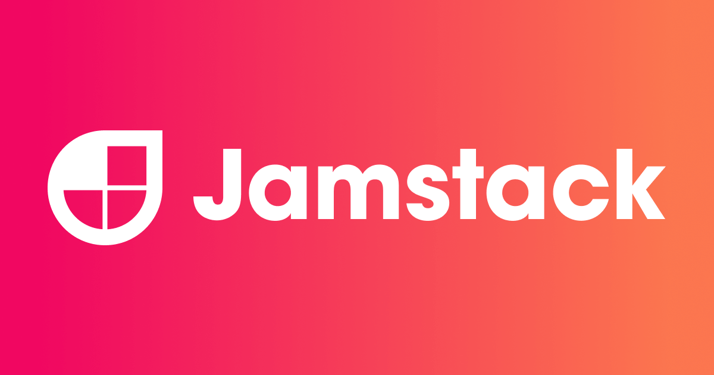

<div align="center" id="top">
  

</div>

<h1  align="center">NextJS, Typescript, GraphQL e GraphCMS</h1>

<br>

## :dart: About

Blog builded with NextJS, Typescript, GraphQL and GraphCMS.

## :rocket: Technologies

The following tools were used in this project:

- [React](https://pt-br.reactjs.org/)
- [NextJS](https://nextjs.org/)
- [GraphQL](https://graphql.org/)
- [Jamstack](https://jamstack.org/)
- [GraphCMS](https://graphcms.com/)
- [TypeScript](https://www.typescriptlang.org/)

## :white_check_mark: Requirements

Before starting :checkered_flag:, you need to have [Git](https://git-scm.com) and [Node](https://nodejs.org/en/) installed.

## :checkered_flag: Starting

```bash
# Clone this project
$ git clone https://github.com/davi1985/jamstack

# Access
$ cd jamstack

# Install dependencies
$ yarn

# Run the project
$ yarn start

# The server will initialize in the <http://localhost:3000>
```

Made with :heart: by <a href="https://github.com/davi1985" target="_blank">Davi Silva</a>

&#xa0;

<a href="#top">Back to top</a>
